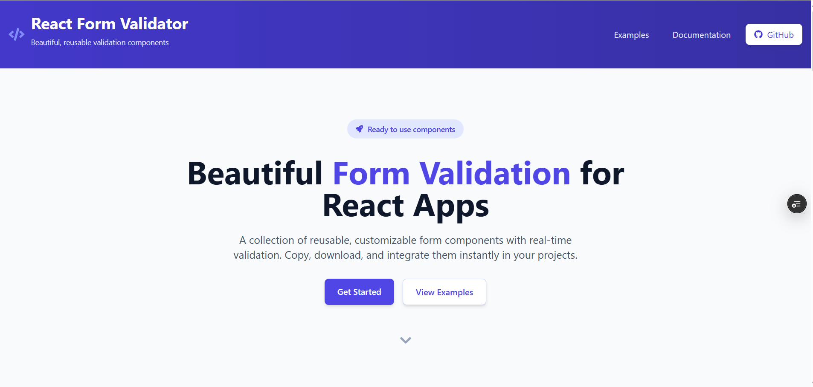

# 🚀 React Dynamic Form Validation

<div align="center">
  
  
  
  **Beautiful, accessible, and powerful form validation for React applications**
  
  [](https://react-dynamic-form-validation.vercel.app/)
  [](LICENSE)
  [](https://reactjs.org)
  [](https://typescriptlang.org)
  [](https://tailwindcss.com)
  
  <p>
    <a href="#✨-features">Features</a> •
    <a href="#🖥️-demo">Demo</a> •
    <a href="#⚡-quick-start">Quick Start</a> •
    <a href="#📚-documentation">Documentation</a> •
    <a href="#🤝-contributing">Contributing</a>
  </p>
  
</div>

---

## ✨ Features

<table>
<tr>
<td width="50%">

### 🎯 **Validation & UX**
- 📝 **Multiple Field Types** - Text, email, password, number, and more
- 🚀 **Real-time Validation** - Instant feedback as users type
- 🔧 **Customizable Rules** - Built-in validators + custom validation logic
- 🎨 **Modern UI/UX** - Clean design with smooth animations
- ♿ **Accessibility First** - ARIA attributes and keyboard navigation

</td>
<td width="50%">

### 🛠️ **Developer Experience**
- 🌐 **Backend Integration** - Frontend + backend validation examples
- � **TypeScript Support** - Fully typed for better DX
- ⚡ **Lightweight** - Minimal dependencies, optimized performance
- 🔄 **Hot Reload** - Fast development with Vite
- 📱 **Responsive Design** - Works perfectly on all devices

</td>
</tr>
</table>

## 🖥️ Demo

### [🌟 View Live Demo](https://react-dynamic-form-validation.vercel.app/) 

**What you'll see:**
- Interactive form examples with real-time validation
- Frontend and backend integration patterns  
- Customizable validation rules in action
- Accessible form design principles
- Performance optimizations

## ⚡ Quick Start

### Prerequisites
- Node.js 16+ 
- npm/yarn/pnpm

### Installation

```bash
# 📥 Clone the repository
git clone https://github.com/gauravkhatriweb/react-dynamic-form-validation.git

# 📂 Navigate to project
cd react-dynamic-form-validation

# 📦 Install dependencies
npm install

# 🚀 Start development server
npm run dev

# 🌐 Open http://localhost:5173
```

### Build for Production

```bash
# 🏗️ Build optimized version
npm run build

# 👀 Preview production build
npm run preview
```

## 🚀 Usage

### Basic Implementation

```jsx
import SmartForm from './components/SmartForm';
import { validators } from './utils/validation';

function LoginForm() {
  const fields = [
    {
      name: 'email',
      label: 'Email Address',
      type: 'email',
      placeholder: 'john@example.com',
      required: true
    },
    {
      name: 'password',
      label: 'Password',
      type: 'password',
      placeholder: 'Enter secure password',
      required: true
    }
  ];

  const validationRules = {
    email: [
      {
        validator: validators.required,
        message: 'Email is required'
      },
      {
        validator: validators.email,
        message: 'Please enter a valid email address'
      }
    ],
    password: [
      {
        validator: validators.required,
        message: 'Password is required'
      },
      {
        validator: (value) => validators.minLength(value, 8),
        message: 'Password must be at least 8 characters long'
      },
      {
        validator: (value) => /(?=.*[a-z])(?=.*[A-Z])(?=.*\d)/.test(value),
        message: 'Password must contain uppercase, lowercase, and number'
      }
    ]
  };

  const handleSubmit = async (values) => {
    try {
      console.log('Form submitted:', values);
      
      // API call example
      const response = await fetch('/api/login', {
        method: 'POST',
        headers: { 'Content-Type': 'application/json' },
        body: JSON.stringify(values)
      });
      
      if (response.ok) {
        // Handle success
        console.log('Login successful!');
      }
    } catch (error) {
      console.error('Login failed:', error);
    }
  };

  return (
    <SmartForm
      fields={fields}
      validationRules={validationRules}
      onSubmit={handleSubmit}
      submitButtonText="Sign In"
      successMessage="Welcome back! You're now logged in."
    />
  );
}
```

### Advanced Usage with Custom Validators

```jsx
// Custom validation for strong passwords
const strongPasswordValidator = (value) => {
  const requirements = [
    { test: /.{12,}/, message: 'At least 12 characters' },
    { test: /[A-Z]/, message: 'One uppercase letter' },
    { test: /[a-z]/, message: 'One lowercase letter' },
    { test: /\d/, message: 'One number' },
    { test: /[!@#$%^&*(),.?":{}|<>]/, message: 'One special character' }
  ];
  
  const failed = requirements.filter(req => !req.test.test(value));
  return failed.length === 0 ? true : failed.map(f => f.message).join(', ');
};

// Custom field renderer
const renderCustomField = (field, props) => {
  if (field.type === 'custom-select') {
    return (
      <select {...props} className="custom-select">
        {field.options?.map(option => (
          <option key={option.value} value={option.value}>
            {option.label}
          </option>
        ))}
      </select>
    );
  }
  return null; // Use default renderer
};
```

## 📚 Documentation

### 🔧 Component API

#### `<SmartForm />` Props

| Prop | Type | Required | Default | Description |
|------|------|----------|---------|-------------|
| `fields` | `FormField[]` | ✅ | - | Array of field configurations |
| `validationRules` | `ValidationRules` | ✅ | - | Validation rules for each field |
| `onSubmit` | `(values) => Promise<void> \| void` | ✅ | - | Form submission handler |
| `submitButtonText` | `string` | ❌ | `"Submit"` | Submit button text |
| `successMessage` | `string` | ❌ | - | Success message after submission |
| `resetOnSubmit` | `boolean` | ❌ | `true` | Reset form after successful submit |
| `renderCustomField` | `(field, props) => ReactNode` | ❌ | - | Custom field renderer |
| `className` | `string` | ❌ | - | Additional CSS classes |
| `disabled` | `boolean` | ❌ | `false` | Disable entire form |

#### `FormField` Interface

```typescript
interface FormField {
  name: string;           // Unique field identifier
  label: string;          // Display label
  type: FieldType;        // Input type (text, email, password, etc.)
  placeholder?: string;   // Placeholder text
  required?: boolean;     // Mark field as required
  disabled?: boolean;     // Disable specific field
  options?: Option[];     // For select fields
  attributes?: object;    // Additional HTML attributes
}
```

### 🔍 Built-in Validators

| Validator | Usage | Description |
|-----------|-------|-------------|
| `required` | `validators.required` | Ensures field has a value |
| `email` | `validators.email` | Validates email format |
| `minLength` | `validators.minLength(value, 8)` | Minimum character length |
| `maxLength` | `validators.maxLength(value, 50)` | Maximum character length |
| `matches` | `validators.matches(value, otherValue)` | Compare two fields |
| `pattern` | `validators.pattern(value, /regex/)` | Custom regex validation |
| `number` | `validators.number` | Validates numeric input |
| `url` | `validators.url` | Validates URL format |

### 🎨 Styling & Theming

The form uses Tailwind CSS classes and can be customized:

```css
/* Custom CSS variables for theming */
:root {
  --form-primary-color: #3b82f6;
  --form-error-color: #ef4444;
  --form-success-color: #10b981;
  --form-border-radius: 0.5rem;
}

/* Override default styles */
.smart-form {
  --tw-shadow: 0 10px 15px -3px rgba(0, 0, 0, 0.1);
}

.smart-form-field {
  @apply transition-all duration-200 ease-in-out;
}
```

## � Project Structure

```
📦 react-dynamic-form-validation
├── 📂 public/
├── 📂 src/
│   ├── 📂 components/
│   │   ├── 📂 SmartForm/          # 🎯 Core form component
│   │   ├── 📂 UI/                 # 🎨 Reusable UI components
│   │   ├── 📂 CodeSnippet/        # 💻 Code display components
│   │   ├── 📂 ExampleSection/     # 📋 Example showcase
│   │   └── 📂 Layout/             # 🏗️ Layout components
│   ├── 📂 hooks/
│   │   └── useForm.ts             # 🪝 Form state management
│   ├── 📂 utils/
│   │   └── validation.ts          # ✅ Validation utilities
│   ├── 📂 examples/
│   │   ├── 📂 frontend/           # 🎨 Frontend examples
│   │   └── 📂 backend/            # 🔧 Backend integration
│   ├── 📂 pages/                  # 📄 Page components
│   ├── 📂 data/                   # 📊 Static data & examples
│   └── 📂 assets/                 # 🖼️ Images & static files
├── 📄 package.json
├── 📄 vite.config.ts
├── 📄 tailwind.config.js
├── 📄 vercel.json                 # 🚀 Deployment config
└── 📄 README.md
```

## 🔧 Configuration

### Vite Configuration

```javascript
// vite.config.ts
import { defineConfig } from 'vite';
import react from '@vitejs/plugin-react';

export default defineConfig({
  plugins: [react()],
  server: {
    port: 3000,
    open: true
  },
  build: {
    outDir: 'dist',
    sourcemap: true
  }
});
```

### Environment Variables

Create a `.env` file for environment-specific configuration:

```bash
# API Configuration
VITE_API_BASE_URL=https://your-api.com
VITE_API_KEY=your_api_key

# Feature Flags
VITE_ENABLE_ANALYTICS=true
VITE_ENABLE_DEBUG=false
```

## 🚀 Deployment

### Deploy to Vercel (Recommended)

```bash
# Install Vercel CLI
npm i -g vercel

# Deploy
vercel

# Production deployment
vercel --prod
```

### Deploy to Netlify

```bash
# Build the project
npm run build

# Deploy dist/ folder to Netlify
# Or connect your GitHub repo for automatic deployment
```

### Docker Deployment

```dockerfile
# Dockerfile
FROM node:18-alpine AS builder
WORKDIR /app
COPY package*.json ./
RUN npm ci
COPY . .
RUN npm run build

FROM nginx:alpine
COPY --from=builder /app/dist /usr/share/nginx/html
EXPOSE 80
CMD ["nginx", "-g", "daemon off;"]
```

## 🧪 Testing

```bash
# Run tests (when configured)
npm test

# Run tests in watch mode
npm test -- --watch

# Generate coverage report
npm test -- --coverage
```

## 🐛 Troubleshooting

### Common Issues

**Issue: Form not submitting**
```bash
# Check console for validation errors
# Ensure all required fields have validation rules
# Verify onSubmit function is properly defined
```

**Issue: Styles not loading**
```bash
# Ensure Tailwind CSS is properly configured
npm run build:css  # Rebuild CSS if needed
```

**Issue: TypeScript errors**
```bash
# Check TypeScript configuration
npx tsc --noEmit  # Type check without building
```

### Performance Optimization

```javascript
// Lazy load heavy components
const HeavyForm = lazy(() => import('./components/HeavyForm'));

// Memoize validation rules
const validationRules = useMemo(() => ({
  email: [validators.required, validators.email]
}), []);

// Debounce validation for better performance
const debouncedValidation = useCallback(
  debounce((value) => validateField(value), 300),
  []
);
```

## 📊 Browser Support

| Browser | Version | Support |
|---------|---------|---------|
| Chrome | 90+ | ✅ Full |
| Firefox | 88+ | ✅ Full |
| Safari | 14+ | ✅ Full |
| Edge | 90+ | ✅ Full |
| IE | 11 | ❌ Not supported |

## 🤝 Contributing

We welcome contributions! Here's how to get started:

### Development Setup

```bash
# Fork the repository
git clone https://github.com/YOUR_USERNAME/react-dynamic-form-validation.git

# Create a feature branch
git checkout -b feature/amazing-feature

# Make your changes and commit
git commit -m "Add amazing feature"

# Push to your branch
git push origin feature/amazing-feature

# Open a Pull Request
```

### Contribution Guidelines

- ✅ Follow the existing code style
- ✅ Add tests for new features
- ✅ Update documentation
- ✅ Ensure all tests pass
- ✅ Keep commits focused and descriptive

### Development Commands

```bash
# Start development server
npm run dev

# Type checking
npm run type-check

# Linting
npm run lint

# Format code
npm run format

# Build for production
npm run build
```

## 📈 Roadmap

- [ ] 🎯 **v2.0** - Enhanced validation engine
- [ ] 🔌 **Plugin System** - Extensible validation plugins
- [ ] 🌍 **i18n Support** - Multi-language validation messages
- [ ] 📱 **React Native** - Mobile app support
- [ ] 🧪 **Testing Utils** - Testing utilities for forms
- [ ] 📊 **Analytics** - Form interaction analytics
- [ ] 🎨 **Theme Builder** - Visual theme customization tool

## 📝 License

This project is licensed under the **MIT License** - see the [LICENSE](LICENSE) file for details.

## 📬 Contact & Support

<div align="center">

**Gaurav Khatri** - [gauravkhatriweb@gmail.com](mailto:gauravkhatriweb@gmail.com)

[](https://github.com/gauravkhatriweb)
[](https://linkedin.com/in/gauravkhatriweb)

### 🐛 Found a Bug? Need Help?

[](https://docs.google.com/forms/d/e/1FAIpQLSezjlxxQNj8Kxi8-qtfkdNGmfNQ9bHGDdqvzqBAeaauUsvpFQ/viewform?usp=dialog)

**When reporting issues, please include:**
- 📝 Brief description of the issue
- 🔄 Steps to reproduce
- ✅ Expected vs actual behavior
- 📸 Screenshots (if applicable)
- 💻 Browser and OS information
- ⚛️ React/Node version
- 💻 Code snippet demonstrating the issue

</div>

---

<div align="center">
  
  **⭐ Star this repository if you found it helpful!**
  
  Made with ❤️ by [Gaurav Khatri](https://github.com/gauravkhatriweb)
  
</div> 